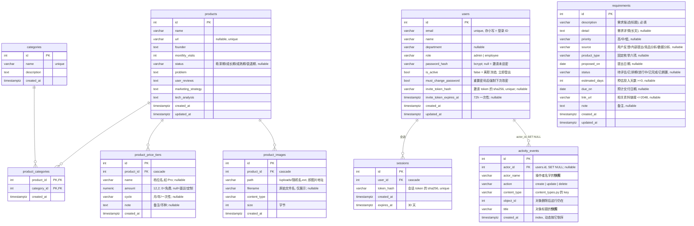

# producthub 架构

> 需求来源:产品数据见 `第二版产品-已完成.md`,多账号登录见 `第三版产品-已完成.md`,
> 导航改造 / 需求记录 / 首页动态见 `第四版产品-开发中.md`。
> 本文描述当前实现与关键约定,代码有改动时应同步更新。

多账号的产品研究整理工具(第四版):**邮箱登录 + 管理员建员工账号,登录后全员共享同一份产品研究数据**;
除产品外还记录**需求**,首页汇总动态与各类条目数量。后端 REST API + Postgres(服务端会话,
HttpOnly cookie),前端 React SPA。开发在本机单机跑
(前端 Vite 开发代理调用后端);要上线时打包成单一 Docker 镜像部署到 Railway 等平台(见
`doc/部署.md`),schema 变更一律走 **Alembic 迁移**。

## 技术栈

| 层 | 选型 |
| --- | --- |
| 后端 | Python 3.10(conda env `web`)、FastAPI、Pydantic v2 |
| ORM | SQLAlchemy 2.0(declarative,`Mapped` / `mapped_column`) |
| 数据库 | PostgreSQL(本地 Homebrew,端口 5432,OS 用户免密;线上用 Railway Postgres) |
| 迁移 | Alembic(schema 版本化,随发布自动 `upgrade head`;测试库仍现建现删,不进链) |
| 部署 | Railway(仓库根 Dockerfile;FastAPI 同进程托管前端 dist),见 `doc/部署.md` |
| 测试 | 标准库 `unittest` + FastAPI `TestClient`,跑在独立 `producthub_test` 库 |
| 前端 | React 19、Vite 8、TypeScript、Ant Design 6、react-router 7 |
| 包管理 | pnpm(前端);依赖锁文件 `frontend/pnpm-lock.yaml` 入库 |

## 目录结构

```
producthub/
├── 第四版产品-开发中.md  # 本版需求(导航改造 / 需求记录 / 首页动态与汇总)
├── .env                 # 本地配置(连接串 / SMTP / ADMIN_*),不入库(模板见 .env.example)
├── app/                 # FastAPI 后端
│   ├── main.py          # 入口:/api 路由 → /uploads 静态 → dist SPA 兜底;lifespan 引导首管理员
│   ├── db.py            # 引擎/会话(读 DATABASE_URL,自动补 psycopg 驱动后缀)
│   ├── models.py        # SQLAlchemy 模型(含 users / sessions / requirements / activity_events)
│   ├── schemas.py       # Pydantic 输入输出 Schema(含 Auth / User / Requirement / 首页)
│   ├── content_types.py # 「有哪些内容类型」的唯一出处:事件写入 / 汇总计数 / 动态链接都读它
│   ├── crud.py          # 抽出来的是逐字相同的**行**(get_or_404 / apply_patch / commit_or_409 / record_event)
│   ├── security.py      # bcrypt 哈希 / token(会话+邀请)/ 临时密码
│   ├── deps.py          # 登录态依赖:read_session_user → get_current_user → require_admin
│   ├── mailer.py        # SMTP 邀请 / 重置邮件(标准库 smtplib,env 配置)
│   ├── bootstrap.py     # 空库 + env 有 ADMIN_* → 自动建首个管理员(幂等)
│   ├── storage.py       # uploads/ 目录与图片类型/大小限制
│   ├── static_assets.py # SpaStaticFiles:深链接回退 index.html,/api 404 不吞
│   └── routers/         # auth.py、users.py、categories.py、products.py、requirements.py、home.py
├── migrations/          # Alembic 迁移(env.py 接 app.db/models,versions/ 存放)
├── alembic.ini          # Alembic 配置(script_location=migrations)
├── Dockerfile           # 生产镜像(多阶段:构建 dist → 跑后端),Railway 用
├── scripts/
│   └── docker-entrypoint.sh  # 容器入口:先 alembic upgrade head 再起 uvicorn
├── uploads/             # 上传的图片文件(不入库,.gitignore 忽略;线上挂 volume)
├── tests/               # unittest,隔离到 producthub_test;每个用例先自建默认管理员再真实登录
├── doc/                 # 架构 / API / 部署(Railway runbook)
└── frontend/            # React SPA
    └── src/
        ├── api/         # client.ts(封装 fetch + 401 回调)+ resources.ts(业务接口,含 crud<T>() 工厂)
        ├── auth/        # AuthContext.tsx(AuthProvider / useAuth / RequireUser / RequireAuth / RequireAdmin)
        ├── types.ts     # 与后端 schema 对齐的 TS 类型(snake_case)
        ├── statusMeta.ts / requirementMeta.ts  # 枚举取值对应的 Tag 颜色(仅展示层)
        ├── components/  # AppLayout(横贯顶栏 + 三项侧栏)/ CategoryManageModal / PhilosophyHero
        └── pages/       # HomePage / ProductList / ProductFormPage / ProductDetail /
                         # RequirementList / RequirementDetail / RequirementFormPage /
                         # Login / AccountsPage / ChangePasswordPage / SetPasswordPage(懒加载)
```

## 运行与测试

后端(项目根目录):

```bash
conda activate web
uvicorn app.main:app --reload        # http://127.0.0.1:8000
```

前端(需先 `conda activate web` 无关,用系统 pnpm):

```bash
cd frontend
pnpm install                          # 已装则跳过
pnpm dev                              # http://localhost:5173,Vite 代理 /api → 8000
```

**建表与迁移(Alembic)**:开发库 `producthub` 已 stamp 到迁移链 head;之后 schema 变更一律走迁移,不再
手工 `create_all`:

```bash
python -m alembic upgrade head        # 空库建全表 / 旧库增量升级(dev 库已打标,这里同步用)
python -m alembic revision --autogenerate -m "改动说明"   # 模型改了之后,生成增量迁移(需人工复查)
python -m alembic current             # 看当前版本
```

`migrations/env.py` 的连接串与表元数据取自应用代码(`app.db` / `app.models`),不用改 `alembic.ini`。
已建好表、不想重跑迁移的库用 `alembic stamp head` 打标记。

**生产形态**:前端 `pnpm build` 产出 `frontend/dist` 后,后端可同进程托管
(`GET /` 及深链接回退 index.html,见 `app/static_assets.py`);线上打包见 `doc/部署.md`。

测试(跑在 `producthub_test` 库,自动创建,不影响开发数据;不依赖迁移):

```bash
conda activate web
cd <项目根目录>
python -m unittest discover -s tests -v
```

> 第三版加了登录门禁后,`tests/base.py` 在每个用例的 setUp 里**直插一个默认管理员并真实登录**
> (`self.client` 带会话 cookie),所以既有直打业务 `/api` 的用例不用逐条改。鉴权相关的单测在
> `tests/test_auth.py` 与 `tests/test_users.py`(后者 mock 掉 `app.mailer`,不真发邮件)。
>
> ⚠️ **加新表时别忘了 `tests/base.py` 的 `_truncate_all()`** —— 它是一张**硬编码的表名列表**,
> 漏了的话新表的数据会在用例之间泄漏,是最难查的那种失败。第四版加 `requirements` 与
> `activity_events` 时就踩在这条线上(见 `tests/test_requirements.py` / `test_activity.py`)。

## 数据模型

核心产品表(三张主表 + 两张随产品的子表)+ 第三版的**账号 / 会话**两张表
+ 第四版的**需求 / 动态**两张表:



要点:

- **products ↔ categories 是多对多**,用中间表 `product_categories` 表达;实现上是"关联对象"
  (`ProductCategory` 独立模型,复合主键 `(product_id, category_id)`)。
- **分级定价**是产品的子表 `product_price_tiers`(一档一条:档名/金额/周期/备注),按录入顺序
  展示;ORM 侧以 `Product.price_tiers` 关系 + delete-orphan 管理。金额存 `Numeric(12,2)`,
  schema 暴露为 `float|None`(0 = 免费,空 = 面议);币种不建模,写进 note。
- **产品素材**是产品的子表 `product_images`,**只存元数据**(服务路径/原始文件名/类型/大小),
  文件本体在项目根 `uploads/`,以 `/uploads` 静态托管。图片**没有说明、没有排序**字段,
  展示顺序即录入顺序(按 id)。ORM 侧 `Product.images` 关系 + delete-orphan 只管元数据行;
  **删文件由图片的 DELETE 端点负责**。
- 外键都 `ON DELETE CASCADE`:删产品会清掉它的标签行、定价档位与图片元数据行;
  删分类只会把该标签从相关产品上移除,**产品记录本身不受影响**。

### 账号与会话(第三版)

- **登录 = 服务端会话 + HttpOnly cookie**:登录成功在 `sessions` 存一条会话
  (明文随机 token 只回给浏览器,库里存其 **sha256**),cookie `producthub_session`
  `HttpOnly + SameSite=Lax + path=/`,仅当 `APP_BASE_URL` 以 `https://` 开头才带 `Secure`。
  **无 JWT / 无 SECRET_KEY / 无 CSRF token**(SameSite=Lax 对同源内部工具足够)。登出删当前
  会话;禁用员工 / 重置密码 / 改密会**删除该用户的其它会话**(踢下线)。
- **用户来源**:没有公开注册页。账号只能由管理员在「账号管理」里创建;**第一个管理员**在库空
  且 env 配了 `ADMIN_EMAIL/ADMIN_PASSWORD` 时由启动 lifespan 自动创建(幂等)。创建后发**邀请
  邮件**(内含一次性链接,72h),员工点链接自设密码即自动登录。
- **账号字段**:`email` 唯一且**存小写**、不可改(登录 ID);`role ∈ {admin, employee}`,本期不在
  界面升降级;`password_hash` 为 bcrypt,**未设 = 邀请未完成**(登录会失败)。停用 = `is_active=false`
  (离职冻结),登录被拒且已有会话立即失效。
- **密码策略**:8–72 位即可,不强制复杂度。72 是 bcrypt 只哈希前 72 字节的上限;系统临时密码
  (重置用)12 位、保证含字母+数字。邀请/会话 token 均随机生成,库只存 sha256。
- **重置密码**:管理员触发 → 生成临时密码发邮件 + `must_change_password=true` + 删全部会话。
  之后该用户**改密前打不到任何业务接口**(`get_current_user` 层 403「请先修改密码」)。
- **依赖分层**(`app/deps.py`):`read_session_user`(宽松:只要有效登录态,否则 401)→
  `get_current_user`(业务数据用:must_change 时 403 硬门禁)→ `require_admin`(users 路由全挂此层,
  非 admin 403)。products / categories 挂 `get_current_user`(登录即用)。
- **公开面**:`/api/auth/*`(登录/登出/改密)、`/api/health`(探活)、`/uploads`(产品图片,`` 需要)
  保持公开;**products / categories / users 一律需登录**。如日后收紧 `/uploads`,把静态挂载挪进依赖
  即可。
- **邮件(SMTP)**:stdlib `smtplib`,env 配 `SMTP_HOST / SMTP_FROM`(缺任一视为未配置)。邀请/重置
  邮件发不出时,对应创建/重置接口**整体回滚并 503**,绝不留下「库里建了号、用户却收不到信」的状态。
  护栏:最后一个启用中的 admin **不允许被禁用或重置密码**(避免管理员全体锁死)。

### 需求与动态(第四版)

- **需求**只有标量字段,没有子表也没有多对多 —— 所以路由里那几行走 `app/crud.py` 的纯函数就够,
  不用像 `products.py` 那样手工组装响应。四个枚举字段(`priority` / `source` / `product_type` /
  `status`)**存中文**,取值表在 `app/schemas.py`,前端 `types.ts` 有同名 `as const` 数组对应。
- **产品类型是固定枚举**,不复用「分类」表(categories 表达的是"这份研究属于哪个主题",
  两者语义不同,混用会逼出"分类是不是产品类型"的分支)。
- **动态是独立事件表** `activity_events`,不是从各表时间戳现算:现算答不了"谁改的"和"改了什么",
  更答不了"删掉了什么"(行都没了)。`actor_name` 与 `title` 存的是**快照**,所以用户改名、
  对象被删之后,历史动态仍然读得通。
- **`app/content_types.py` 是「有哪些内容类型」的唯一出处**:事件写入要用它取标题字段、
  汇总要遍历它做 `count(*)`、首页动态要按它的 `path` 拼链接。写死三处的话,以后加会议必漏一处
  且不报错。它**只存事实、不存逻辑** —— 一旦开始长出"如果这个类型有分类关联就……"的分支,
  就是抽象过度,该退回去。
- **记录点是写端点里显式的一行** `crud.record_event(...)`,删除时必须在 `db.delete` **之前**调用
  (提交后就读不到标题快照了)。分类**不记**:它是标签不是内容,记了会把动态稀释成流水账。
  漏记不会报错,由 `tests/test_activity.py` 逐操作断言兜住。

### 抽象边界(第四版定稿)

判据是:

```
偶尔重复 → 先重复
稳定重复 → 抽象
抽象之后出现大量 if/else → 抽象过度
```

据此:

| 抽了 | 为什么 |
| --- | --- |
| `app/crud.py` 的四个纯函数 | 这些**行**在多个端点里逐字相同,是稳定重复 |
| `frontend/src/api/resources.ts` 的 `crud<T>()` 工厂 | 标准五件套的转发函数有十几份逐字相同的副本 |
| `app/content_types.py` | 不是抽象,是三处需求的共同出处(见上) |

| 没抽 | 为什么 |
| --- | --- |
| 后端端点本身 | **稳定的是「行」,不是「端点」**:products 要预加载三张子表并手工组装响应,users 要发邀请邮件,形状并不同。硬抽成基类会立刻长出 if/else |
| 前端列表页的加载逻辑 | 第四版时只有两处(产品、需求),**先重复**;等会议列表页出现(第三处)再抽 |
| 事件记录 | 每个写端点显式一行。漏记的风险靠测试兜,不靠架构兜 |

### 图片存储约定(app/storage.py)

- DB `product_images.path` 存的就是浏览器可直接访问的服务路径(如 `/uploads/ab12.png`),
  落盘名是 `uuid4().hex + 扩展名`(扩展名从 content-type 白名单映射,**不信任用户文件名**)。
- `filename` 保留上传时的原始文件名,仅作磁贴角标展示,不参与落盘命名。
- 允许 `image/jpeg|png|gif|webp`,单张上限 10 MB;超限/非图片由端点 `4xx` 拒绝。
- 目录位置可用 `UPLOAD_DIR` 环境变量覆盖(测试指向临时目录);启动时若不存在会自动创建。
- `products.url` 唯一(URL 重复会 409);`categories.name` 唯一。
- `created_at / updated_at` 由数据库 `server_default = now()` 生成,`updated_at` 随行更新 `onupdate`。
- 时间戳带时区(`DateTime(timezone=True)`,存 Postgres `timestamptz`)。

## 字段契约:产品.md → 数据库 → 前端

数据库列名、后端 Schema、前端 TS 类型**全部 snake_case**,与 `产品.md` 的字段一一对应:

| 产品.md(表单) | DB 列(products) | 类型 / 约束 | 前端 TS | 表单控件 |
| --- | --- | --- | --- | --- |
| 产品名 | `name` | `str ≤255`,必填 | `Product.name` | Input |
| 网址 | `url` | `str ≤2048`,可空,唯一;空串按 null | `Product.url?` | Input |
| 创始人信息 | `founder` | `text`,可空 | `Product.founder?` | TextArea |
| 月活量 | `monthly_visits` | `int ≥0`,可空 | `Product.monthly_visits?` | InputNumber |
| 产品状态 | `status` | `str ≤20`,可空;四选一(生命周期):萌芽期/成长期/成熟期/衰退期 | `Product.status?` | Select |
| 产品解决的问题 | `problem` | `text`,可空 | `Product.problem?` | TextArea |
| 网站的用户评价 | `user_reviews` | `text`,可空 | `Product.user_reviews?` | TextArea |
| 网站的营销策略 | `marketing_strategy` | `text`,可空 | `Product.marketing_strategy?` | TextArea |
| 产品技术分析 | `tech_analysis` | `text`,可空;空串按 null | `Product.tech_analysis?` | TextArea |
| — | `categories` | 关联完整对象 `Category[]` | `Product.categories` | 多选(见下) |

categories 表对应"自定义产品分类":

| DB 列 | 类型 / 约束 | 说明 |
| --- | --- | --- |
| `id` | int PK | |
| `name` | `str ≤100`,唯一 | 分类名 |
| `description` | `text`,可空 | 当前界面未采集,字段预留 |
| `created_at` | timestamptz | |

需求记录(第四版)的字段契约 —— 表头是需求里给的叫法:

| 需求里的叫法 | DB 列(requirements) | 类型 / 约束 | 前端 TS | 表单控件 |
| --- | --- | --- | --- | --- |
| 需求描述 | `description` | `str ≤255`,必填 | `Requirement.description` | Input |
| 需求详情 | `detail` | `text`,可空 | `Requirement.detail?` | TextArea |
| 优先级 | `priority` | `str ≤20`,可空;高/中/低 | `Requirement.priority?` | Select |
| 需求来源 | `source` | `str ≤50`,可空;用户反馈/内部提出/竞品分析/数据分析 | `Requirement.source?` | Select |
| 产品类型 | `product_type` | `str ≤20`,可空;固定六项 | `Requirement.product_type?` | Select |
| 提出日期 | `proposed_on` | `date`,可空 | `Requirement.proposed_on?` | DatePicker |
| 进展状态 | `status` | `str ≤20`,可空;五档 | `Requirement.status?` | Select |
| 预估投入天数 | `estimated_days` | `int ≥0`,可空 | `Requirement.estimated_days?` | InputNumber |
| 预计交付日期 | `due_on` | `date`,可空 | `Requirement.due_on?` | DatePicker |
| 相关资料链接 | `link_url` | `str ≤2048`,可空;空串按 null | `Requirement.link_url?` | Input |
| 备注 | `note` | `text`,可空 | `Requirement.note?` | TextArea |

**「需求描述」是标题,「需求详情」是长文** —— 列表页只显示前者,后者只在详情页展开。
日期在 JSON 里一律是 `YYYY-MM-DD` 字符串(`DatePicker` 经 dayjs 格式化后提交)。
dayjs 是显式依赖(`frontend/package.json`):antd 自己也依赖它,但 pnpm 的 node_modules 是严格模式,
不写进 `package.json` 会直接编译不过。

前端约定:

- **请求/响应字段全 snake_case**,`src/types.ts` 与 `app/schemas.py` 同步维护。
- 产品负载里给产品打标传 `category_ids: number[]`;读回的产品内嵌完整 `categories` 对象
  (便于直接渲染 Tag),两者是同一关联的两面。
- PATCH 语义(重要):请求体里**没出现的键不改动**。子集合键缺席=不动、`[]`=清空、带内容=整组替换:
  - `category_ids: number[]` 打分类;
  - `price_tiers: [{name?, amount?, cycle?, note?}]` 分级定价(金额 `0` = 免费、空 = 面议,
    `cycle` 取 月/年/一次性,其余文本;响应按录入顺序)。
- **图片不在这套 JSON 子集合里**:上传 / 删除带文件与副作用,走独立 REST 端点
  (见 `doc/API.md` 的 Product images),产品的 JSON 里只内嵌只读的 `images` 元数据列表
  (按 id 录入顺序,无说明、无排序)。

## 关键实现约定

- 后端所有错误统一 `{"detail": ...}`,前端 `client.ts` 解析后抛 `Error`,界面用 `message.error` 展示。
- Pydantic 全局去首尾空白;`url` / `description` / `tech_analysis` / `link_url` 等可选文本空串归一为 `null`。
- `status` 只接受四档取值(Literal,生命周期四档),空串也非法;清空传 `null`。
  需求的四个枚举字段同款(Literal),清空同样传 `null`。
- **抽象边界**见上文「抽象边界(第四版定稿)」。改这块之前先读那段 —— 尤其是"稳定的是行不是端点"。
- env 一律在函数内 `os.getenv` 现读(避免模块导入顺序 / 测试覆盖 env 的坑;全项目只在
  `app/db.py` import 时 `load_dotenv` 一次)。`.env` 模板见 `.env.example`。
- 前端 `client.ts` 遇到 **401** 会调注册的全局回调(`AuthProvider` 挂载时注册):登录/设密页的 401
  只是表单报错;其它页面收到 401(会话过期/被踢)即清空本地用户,`RequireAuth` 自动跳登录页。
- 前端路由门禁(`src/auth/AuthContext.tsx`):`RequireAuth`(未登录 → `/login`;登录但
  `must_change_password` → `/change-password`)包着业务页与 `/users`;`/users` 外再套 `RequireAdmin`
  (非 admin 回首页)。`/login`、`/set-password` 公开,`/change-password` 需登录但不卡改密门禁。
- 前端路由表(`src/App.tsx`,第四版):`/` 首页、`/products`(产品分析)、`/requirements`(需求记录)
  各自带 `new` / `:id` / `:id/edit` 子路由,全在 `AppLayout` 之下;`/users` 仅管理员。
- **布局(第四版)**:`AppLayout` 外层 `Layout` 直接放 `Header`(横贯整宽:左品牌、右用户菜单),
  内层再放 `Sider` + `Content`;侧栏是**三项固定导航**(首页 / 产品分析 / 需求记录),
  `selectedKeys` 由 `location.pathname` 推出。**搜索框与「新建」按钮不在顶栏** ——
  它们是页面级动作,各自待在列表页的工具条里(产品分析页的工具条还带分类下拉与管理分类入口)。
- 前端路由级懒加载(`React.lazy`),各页面独立 chunk。
- 列表页的筛选状态**只存在 URL 里**(`?cat=` / `?q=`),不放全局 store、不用 React Query;
  页面用 `useState` + `useEffect`(带 `cancelled` 守卫)自己加载。搜索在**前端过滤**结果。
- schema 变更走 Alembic 迁移(见"运行与测试");接口改动请同步 `doc/API.md`;
  部署与发布流程见 `doc/部署.md`。
