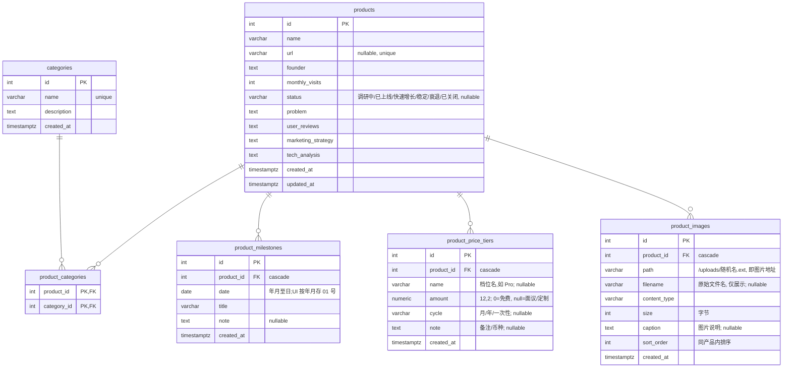

# Producthut 架构

> 需求与数据模型来自根目录 `产品.md`。本文描述当前实现与关键约定,代码有改动时应同步更新。

单机、单用户的个人研究整理工具:**后端 REST API + Postgres**,**前端 React SPA** 通过 Vite 开发代理调用后端。

## 技术栈

| 层 | 选型 |
| --- | --- |
| 后端 | Python 3.10(conda env `web`)、FastAPI、Pydantic v2 |
| ORM | SQLAlchemy 2.0(declarative,`Mapped` / `mapped_column`) |
| 数据库 | PostgreSQL(本地 Homebrew,端口 5432,OS 用户免密) |
| 测试 | 标准库 `unittest` + FastAPI `TestClient`,跑在独立 `producthub_test` 库 |
| 前端 | React 19、Vite 8、TypeScript、Ant Design 6、react-router 7 |
| 包管理 | pnpm(前端);依赖锁文件 `frontend/pnpm-lock.yaml` 入库 |

## 目录结构

```
producthub/
├── 产品.md              # 需求 + 数据库设计(唯一 spec)
├── .env                 # 本地连接串,不入库(模板见 .env.example)
├── app/                 # FastAPI 后端
│   ├── main.py          # 入口,挂 /api 路由 + /uploads 静态
│   ├── db.py            # 引擎/会话(从根目录 .env 读 DATABASE_URL)
│   ├── storage.py       # uploads/ 目录与图片类型/大小限制
│   ├── models.py        # SQLAlchemy 模型
│   ├── schemas.py       # Pydantic 输入输出 Schema
│   └── routers/         # categories.py / products.py(含图片端点)
├── uploads/             # 上传的图片文件(不入库,.gitignore 忽略)
├── tests/               # unittest,隔离到 producthub_test
├── doc/                 # 本文档
└── frontend/            # React SPA
    └── src/
        ├── api/         # client.ts(封装 fetch)+ resources.ts(业务接口)
        ├── types.ts     # 与后端 schema 对齐的 TS 类型(snake_case)
        ├── components/  # AppLayout / CategoryManageModal
        └── pages/       # ProductList / ProductFormPage / ProductDetail(懒加载)
```

## 运行与测试

后端(项目根目录):

```bash
conda activate web
uvicorn app.main:app --reload        # http://127.0.0.1:8000
```

前端(需先 `conda activate web` 无关,用系统 pnpm):

```bash
cd frontend
pnpm install                          # 已装则跳过
pnpm dev                              # http://localhost:5173,Vite 代理 /api → 8000
```

首次建表:后端表结构用 SQLAlchemy `Base.metadata.create_all`,直接对着空库跑一次即可
(个人工具规模,暂不用 Alembic 迁移;库结构有变时手动重建或补迁移)。

测试(跑在 `producthub_test` 库,自动创建,不影响开发数据):

```bash
conda activate web
cd <项目根目录>
python -m unittest discover -s tests -v
```

## 数据模型

核心三张表 + 随产品的子表:



要点:

- **products ↔ categories 是多对多**,用中间表 `product_categories` 表达;实现上是"关联对象"
  (`ProductCategory` 独立模型,复合主键 `(product_id, category_id)`)。
- **发展历程**是产品的子表 `product_milestones`(一条产品多条节点,按时间正序),随产品
  增删;ORM 侧以 `Product.milestones` 关系 + delete-orphan 管理。
- **分级定价**是产品的子表 `product_price_tiers`(一档一条:档名/金额/周期/备注),按录入顺序
  展示;ORM 侧以 `Product.price_tiers` 关系 + delete-orphan 管理。金额存 `Numeric(12,2)`,
  schema 暴露为 `float|None`(0 = 免费,空 = 面议);币种不建模,写进 note。
- **产品素材**是产品的子表 `product_images`,**只存元数据**(服务路径/原始文件名/类型/大小/
  说明/排序),文件本体在项目根 `uploads/`,以 `/uploads` 静态托管。ORM 侧 `Product.images`
  关系 + delete-orphan 只管元数据行;**删文件由图片的 DELETE 端点负责**。
- 外键都 `ON DELETE CASCADE`:删产品会清掉它的标签行、发展历程、定价档位与图片元数据行;
  删分类只会把该标签从相关产品上移除,**产品记录本身不受影响**。

### 图片存储约定(app/storage.py)

- DB `product_images.path` 存的就是浏览器可直接访问的服务路径(如 `/uploads/ab12.png`),
  落盘名是 `uuid4().hex + 扩展名`(扩展名从 content-type 白名单映射,**不信任用户文件名**)。
- `filename` 保留上传时的原始文件名,仅作磁贴角标展示,不参与落盘命名。
- 允许 `image/jpeg|png|gif|webp`,单张上限 10 MB;超限/非图片由端点 `4xx` 拒绝。
- 目录位置可用 `UPLOAD_DIR` 环境变量覆盖(测试指向临时目录);启动时若不存在会自动创建。
- `products.url` 唯一(URL 重复会 409);`categories.name` 唯一。
- `created_at / updated_at` 由数据库 `server_default = now()` 生成,`updated_at` 随行更新 `onupdate`。
- 时间戳带时区(`DateTime(timezone=True)`,存 Postgres `timestamptz`)。

## 字段契约:产品.md → 数据库 → 前端

数据库列名、后端 Schema、前端 TS 类型**全部 snake_case**,与 `产品.md` 的字段一一对应:

| 产品.md(表单) | DB 列(products) | 类型 / 约束 | 前端 TS | 表单控件 |
| --- | --- | --- | --- | --- |
| 产品名 | `name` | `str ≤255`,必填 | `Product.name` | Input |
| 网址 | `url` | `str ≤2048`,可空,唯一;空串按 null | `Product.url?` | Input |
| 创始人信息 | `founder` | `text`,可空 | `Product.founder?` | TextArea |
| 月活量 | `monthly_visits` | `int ≥0`,可空 | `Product.monthly_visits?` | InputNumber |
| 产品状态 | `status` | `str ≤20`,可空;六选一:调研中/已上线/快速增长/稳定/衰退/已关闭 | `Product.status?` | Select |
| 产品解决的问题 | `problem` | `text`,可空 | `Product.problem?` | TextArea |
| 网站的用户评价 | `user_reviews` | `text`,可空 | `Product.user_reviews?` | TextArea |
| 网站的营销策略 | `marketing_strategy` | `text`,可空 | `Product.marketing_strategy?` | TextArea |
| 产品技术分析 | `tech_analysis` | `text`,可空;空串按 null | `Product.tech_analysis?` | TextArea |
| — | `categories` | 关联完整对象 `Category[]` | `Product.categories` | 多选(见下) |

categories 表对应"自定义产品分类":

| DB 列 | 类型 / 约束 | 说明 |
| --- | --- | --- |
| `id` | int PK | |
| `name` | `str ≤100`,唯一 | 分类名 |
| `description` | `text`,可空 | 当前界面未采集,字段预留 |
| `created_at` | timestamptz | |

前端约定:

- **请求/响应字段全 snake_case**,`src/types.ts` 与 `app/schemas.py` 同步维护。
- 产品负载里给产品打标传 `category_ids: number[]`;读回的产品内嵌完整 `categories` 对象
  (便于直接渲染 Tag),两者是同一关联的两面。
- PATCH 语义(重要):请求体里**没出现的键不改动**。子集合键缺席=不动、`[]`=清空、带内容=整组替换:
  - `category_ids: number[]` 打分类;
  - `milestones: [{date, title, note?}]` 发展历程(date 传 `YYYY-MM` 或 `YYYY-MM-DD`,响应按时间升序);
  - `price_tiers: [{name?, amount?, cycle?, note?}]` 分级定价(金额 `0` = 免费、空 = 面议,
    `cycle` 取 月/年/一次性,其余文本;响应按录入顺序)。
- **图片不在这套 JSON 子集合里**:上传/删除/排序/改说明带文件或单独语义,走独立 REST 端点
  (见 `doc/API.md` 的 Product images),产品的 JSON 里只内嵌只读的 `images` 元数据列表(按
  `(sort_order, id)` 排序)。

## 关键实现约定

- 后端所有错误统一 `{"detail": ...}`,前端 `client.ts` 解析后抛 `Error`,界面用 `message.error` 展示。
- Pydantic 全局去首尾空白;`url` / `description` / `tech_analysis` 空串归一为 `null`。
- `status` 只接受六档取值(Literal),空串也非法;清空传 `null`。
- 前端路由级懒加载(`React.lazy`),三个页面各自独立 chunk。
- 开发期后端建表只跑一次即可;接口改动请同步 `doc/API.md`。
